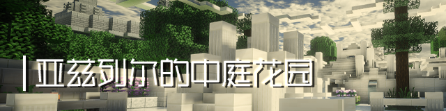
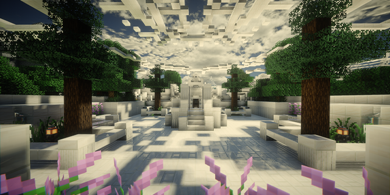
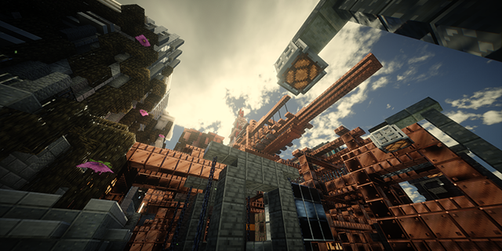
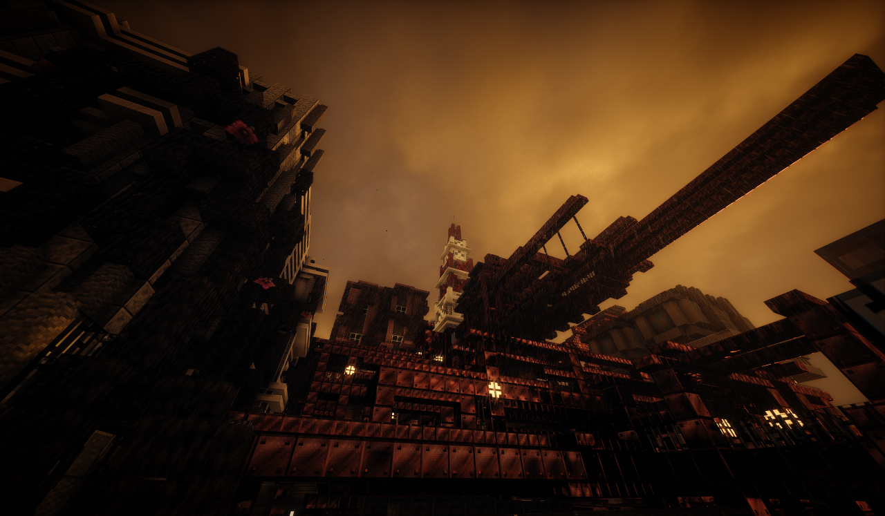

<h1 class="katashigure-title">大型MC服务器  &nbsp;&nbsp;&nbsp;&nbsp;&nbsp;&nbsp;&nbsp;&nbsp;方时雨城（カタシグレ）</h1>

<h4 class="katashigure-quote">“愿这场仅在此地降下的薄雨，见证你的一切过去……”</h4>

 

我们是一款基于Minecraft Java 1.21.1原版的大型正版服务器。服务器中拥有多款风格与玩法不同的游戏，辅以游戏原版的数据包&资源包制作而成。

PVP层面，我们制作了传统类的空岛战争、狙击射箭等小型游戏。而在PVE层面，我们正在开发两款仍在不断更新的中型游戏：

1. **解谜闯关箱庭战斗RPG『亚兹列尔的中庭花园』**

&nbsp;&nbsp;&nbsp;&nbsp;*“注定一死的你，将如何违抗命运？”*

2. **惊悚恐怖战斗解谜RPG『厄珀娅的悲歌』**

&nbsp;&nbsp;&nbsp;&nbsp;*“唯有在最黑暗的阴霾中，生命才能绽放出微薄却仍然耀眼的光辉。”*

 

欢迎游玩我们的服务器！
- **服务器IP地址**：p.tokumei.studio
- **服务器QQ工作群**：783167121

 

<h4 class="katashigure-subtitle3">服务器策划组成员：</h4>

- 杉原夜季
    - 服务器主策划
    - 花园2『厄珀娅的悲歌』主策、制作者
    - 空岛战争、混沌魔方、棋盘战争主策、主要制作者
    - 迷宫「世界塔」主策、制作者
    - 跑酷「梦蝶的长廊」主策、制作者
    - 花园1『亚兹列尔的中庭花园』前主策、主要制作者
- 轩宇1725
    - 服务器策划
    - 实时四子棋主策、制作者
    - 花园1『亚兹列尔的中庭花园』主策、制作者
- 摩尔福斯（Botium）
    - 本地服务器提供者
    - 服务器日常自动备份主负责
    - 前周目修复工程主负责

 

<h4 class="katashigure-subtitle3">服务器管理人员：</h4>

- xiyihan
    - 前周目修复工程副负责
    - 服务器资源主题包云存档管理者
    - *DEBUG & TEST*
- sdgedghdg
    - 服务器插件配置、维护主负责
    - 战桥PVP(曾)制作者
    - 空岛战争PVP(曾)地图贡献者
    - *DEBUG & TEST*
- Pramanix
    - 战桥PVP(曾)制作者
    - Bowspleef(曾)制作者
    - 花园1/2模型制作、提供者
- TeaYYY
    - 空岛战争、棋盘战争部分地图制作者
    - *DEBUG & TEST*

 

 

 

<h1 class="katashigure-title">___________________________________________</h1>

 

<h2 class="katashigure-subtitle">游戏简介</h2>

<h3 class="katashigure-subtitle">『亚兹列尔的中庭花园』</h3>

<h4 class="katashigure-subtitle3">★ &nbsp;&nbsp;游戏背景故事</h4>

&nbsp;&nbsp;&nbsp;&nbsp;死亡。

&nbsp;&nbsp;&nbsp;&nbsp;死亡总是在不经意间，悄然而至。但你并不理解，有着许多未完之事的你，为何偏偏会在此刻意外死去？

&nbsp;&nbsp;&nbsp;&nbsp;你本能活得更久。你本该活得更久。

&nbsp;&nbsp;&nbsp;&nbsp;来到地狱之时，你早已决定试着放下心中的一切，坦然迎接属于自己的最终结局。但魔界的使者，一个自称为恶魔路西法分身的烈焰使者，在你耳边低语。

&nbsp;&nbsp;&nbsp;&nbsp;“其实，这个世界原先还存在天堂。也就是，地狱的相反极。”

&nbsp;&nbsp;&nbsp;&nbsp;如果想要违抗自己的死亡，夺得更久的生命……

&nbsp;&nbsp;&nbsp;&nbsp;——那就， 前往天界的生命树庭园吧。至少，那团被称作路西法之焰的使者是如此告知你的。

 

 

&nbsp;&nbsp;&nbsp;&nbsp;想要活得更久？规则很简单。那便是，攻破那座庭园的守卫，向庭园关口的两位领袖发起挑战。若他们能够认同自己实力的话，那自己就有机会获得庭园之主沙利叶的赏识，获得继续在现实世界活下去的资格。

&nbsp;&nbsp;&nbsp;&nbsp;但……你作为一名手无寸铁的普通人类，如何是好？

&nbsp;&nbsp;&nbsp;&nbsp;魔界的使者赐予了你能够接通灵能网络的能力。只要通过这本附上魔界法术的书籍，便可在灵能网络的帮助下，获得更强的力量，以及装备。被赋予这一切的你，踏上了前往神界庭园的路。

&nbsp;&nbsp;&nbsp;&nbsp;现在，你正伫立于神界生命树庭园的入口前方。

 

<h4 class="katashigure-subtitle3">★ &nbsp;&nbsp;游戏玩法介绍</h4>

&nbsp;&nbsp;&nbsp;&nbsp;探索沙利叶的生命树庭园并与守卫此地的神界军与怪物展开战斗，收集掉落物素材并使用背包中的“生命手册”兑换武器、防具、物品，甚至是其他的素材。

&nbsp;&nbsp;&nbsp;&nbsp;迎接你的将会是愈渐危险强大的敌人。你需要收集装备、学习灵能，击败拦路的守卫，违抗死亡的命运与死亡天使沙利叶的审判。

&nbsp;&nbsp;&nbsp;&nbsp;每当准备完毕，你便可以在地图中展开探索。找到开启下一关的按钮，迎来新一轮的试炼。

&nbsp;&nbsp;&nbsp;&nbsp;不幸于游戏中死亡后，你将丢失本局内获得的所有素材与装备。但似乎，某些已经刻印在你灵魂上的事物将会得以保留……

&nbsp;&nbsp;&nbsp;&nbsp;这座生命树庭园的终点究竟存在着什么？所谓的沙利叶的试炼又是否为真？在神庭的秩序被某种邪恶的力量而瞬间颠覆时，你才将窥见这场“试炼游戏”的真相。

 

 

 

<h1 class="katashigure-title">___________________________________________</h1>

 

<h3 class="katashigure-subtitle">『厄珀娅的悲歌』</h3>

<h4 class="katashigure-subtitle3">★ &nbsp;&nbsp;游戏背景故事</h4>

&nbsp;&nbsp;&nbsp;&nbsp;唯有在最黑暗的阴霾中，生命才能绽放出微薄却仍然耀眼的光辉。

&nbsp;&nbsp;&nbsp;&nbsp;正如最微小的星光也能战胜最深邃的漆黑，徘徊于死亡边际的凡人们也终能违抗神意，改变既定的悲惨结局。

&nbsp;&nbsp;&nbsp;&nbsp;这是发生在久远未来的，由人类编织而成的神话。

&nbsp;&nbsp;&nbsp;&nbsp;神明的不幸陨落造就了天上的崩坏，众天使多数堕为恶魔，被深渊所吞噬。七大天使失去了米迦勒、加百列、拉贵尔、雷米尔。现存的天使仅有沙利叶、拉斐尔、乌列尔三位。

&nbsp;&nbsp;&nbsp;&nbsp;而在这岌岌可危的关头，下位天使临时破格获得升位的同时，一股魔界的神秘势力也在蠢蠢欲动……

&nbsp;&nbsp;&nbsp;&nbsp;2135年6月29日

&nbsp;&nbsp;&nbsp;&nbsp;太平洋中心的忒尔克西钻井平台已失联36小时整。你作为被石油管理局指派前来调查的维修小组成员，即将接触到这场牵扯了人间与神界的宿命纷争。

&nbsp;&nbsp;&nbsp;&nbsp;等待着你的，是任何凡人都无从预料的超自然现象，以及一场即将由你来吟唱的悲歌。

 

<h4 class="katashigure-subtitle3">★ &nbsp;&nbsp;游戏玩法介绍</h4>

&nbsp;&nbsp;&nbsp;&nbsp;本游戏为类死亡空间风格游戏，在渲染恐怖气氛与创造线性体验的同时，增加了可供自由探索与完成的支线部分，并着重描写了同怪物的战斗与能够自由搭配的作战方式。

&nbsp;&nbsp;&nbsp;&nbsp;由于圣水晶的影响，许多的高科技热武器都无法正常使用。最初的你可能只能找到一把勉强得以防身的撬棍。但随着探索的推进，你将能够使用消防斧、工程弩、喷火器与某些更为强大的武器。

&nbsp;&nbsp;&nbsp;&nbsp;在每一章节都会出现全新且更为强大、机制更为独立的怪物。也许你会与他们陷入一番苦战，但试着灵活切换你的攻击方式：有时，不同类型的伤害将会对特定的怪物产生意想不到的致命效果。

 

<h4 class="katashigure-subtitle3">★ &nbsp;&nbsp;章节预览</h4>

&nbsp;&nbsp;&nbsp;&nbsp;随着你在忒尔克西钻井平台的推进，你将会接触到许多意料之外的超自然现象。

&nbsp;&nbsp;&nbsp;&nbsp;在你抵达这座钻井平台前，此处经历了一场残酷而血腥的多方混战。你将会按照特定顺序来到忒尔克西的不同区域，揭开属于这些区域的过去与秘密。

&nbsp;&nbsp;&nbsp;&nbsp;不同的章节可能会拥有截然不同的建筑风格或探索空间，而等待着你的新装备、新攻击手段与神秘可怖的新怪物都将变得更为强大……

| 现存游戏章节&nbsp;&nbsp;&nbsp;&nbsp;&nbsp;&nbsp;&nbsp;&nbsp;&nbsp;&nbsp;    | 主要区域&nbsp;&nbsp;&nbsp;&nbsp;&nbsp;&nbsp;&nbsp;&nbsp;&nbsp;&nbsp;&nbsp;&nbsp;&nbsp;&nbsp;&nbsp;&nbsp;&nbsp;&nbsp;&nbsp;&nbsp;&nbsp;&nbsp;&nbsp;&nbsp;&nbsp;&nbsp;&nbsp;&nbsp;&nbsp;&nbsp;&nbsp;&nbsp;&nbsp;&nbsp;&nbsp;&nbsp;&nbsp;&nbsp;&nbsp;&nbsp;&nbsp;&nbsp;&nbsp;&nbsp;&nbsp;&nbsp;&nbsp;&nbsp;&nbsp;&nbsp;&nbsp;&nbsp;&nbsp;&nbsp;&nbsp;&nbsp;&nbsp;&nbsp;&nbsp;&nbsp;      |  附属区域 &nbsp;&nbsp;&nbsp;&nbsp;&nbsp;&nbsp;&nbsp;&nbsp;&nbsp;&nbsp;&nbsp;&nbsp;&nbsp;&nbsp;&nbsp;&nbsp;&nbsp;&nbsp;&nbsp;&nbsp;&nbsp;&nbsp;&nbsp;&nbsp;&nbsp;&nbsp;&nbsp;&nbsp;&nbsp;&nbsp;&nbsp;&nbsp;        |   曲谱数量   | 
| :-------  ---- | :------------ | :---------- | :---------- |
|  第一章   |  忒尔克西 · 维修层   | 支架  |  3|
|  第二章   |  忒尔克西 · 物资层   | 建材资源附属平台  | 2 |
|  第三章   |  忒尔克西 · 主平台甲板   | 宿舍楼  |  2|
|  第四章   |  水下研究设施 · 冷凝系统 & 实验区   | N/A  |  0|

 

 

<h4 class="katashigure-subtitle3">★ &nbsp;&nbsp;系统机制</h4>

&nbsp;&nbsp;&nbsp;&nbsp;**◇ &nbsp;&nbsp;多功能工作站**

&nbsp;&nbsp;&nbsp;&nbsp;散布在忒尔克西钻井平台各区域的工作站点，可通俗理解为商店。

&nbsp;&nbsp;&nbsp;&nbsp;在站点可以制作或升级装备，购买食物与弹药等。在解锁了不同的工作站点后，你还能使用工作站进行站点间的传送。

&nbsp;&nbsp;&nbsp;&nbsp;**◇ &nbsp;&nbsp;塞壬的指引**

&nbsp;&nbsp;&nbsp;&nbsp;游戏的核心机制之一。收集从怪物身上掉落的石板，并在*多功能工作站*加工成浓缩魔力的魔法铜板。

&nbsp;&nbsp;&nbsp;&nbsp;铜板的魔力会在获取的一瞬间与你的灵魂同化，从而使你本局游戏获得永久性的属性提升。

&nbsp;&nbsp;&nbsp;&nbsp;收集藏匿于钻井平台各处的*曲谱*，即可永久性地解锁该*曲谱*所对应的铜板加工方式。不同的加工方式会使你获取不同种类的铜板。

&nbsp;&nbsp;&nbsp;&nbsp;虽然每次进行“塞壬的指引”时所获得的铜板并不固定，但善用铜板所带来的加成，是某些时刻的制胜关键。

&nbsp;&nbsp;&nbsp;&nbsp;**◇ &nbsp;&nbsp;水晶魔板**

&nbsp;&nbsp;&nbsp;&nbsp;不同于普通的铜板，水晶魔板在获得的刹那便会深深刻入你的灵魂，永久解锁。其所带来的提升效果与全新主动技能将会在你未来的游戏体验中保持可用状态。

&nbsp;&nbsp;&nbsp;&nbsp;目前存在于游戏内的魔板分别有：

- 光棱魔板  
    - 使得你背包内的箭矢定期缓慢转换为*静滞光棱箭*。同时持有的*光棱箭*会有数量限制（初始为3，不包括已装载于工程弩中的*光棱箭*）。
    - 射出*静滞光棱箭*后，以箭矢飞行轨迹为圆心的柱状区域内，怪物遭受极大幅度的减速，持续数秒。
    - 似乎也有完全免疫*光棱魔板*的怪物存在，请务必小心……
- 残影魔板
    - 使得你每次缓下脚步时能够在一定时间后冲刺。屏幕右上角的绿色四叶灯亮起时，便意味着你能够通过疾跑激活技能效果。
    - 在技能发动时，你的移动速度、防御力都会巨量提升。同时，你也会获得百分之百的抗击退霸体。
    - 可以通过点击背包内的*残影魔板*禁用此技能。

 

<h4 class="katashigure-subtitle3">★ &nbsp;&nbsp;登场角色</h4>

|角色 &nbsp;&nbsp;&nbsp;&nbsp;&nbsp;&nbsp;&nbsp;&nbsp;&nbsp;&nbsp;&nbsp;&nbsp;&nbsp;&nbsp;&nbsp;&nbsp;&nbsp;&nbsp;&nbsp;&nbsp;&nbsp;&nbsp;&nbsp;&nbsp;&nbsp;| 简介|
| :------- | :------------|
| 主角（玩家）| 太平洋石油管理局应急调查小组成员，精通各项维修技术。 在忒尔克西钻井平台失联24小时后，你被派往钻井平台进行调查作业。 |
 
| 法莫洛斯| 忒尔克西钻井平台的医务部门主管。第一批察觉到古代细菌存在的平台居民。尝试为感染细菌的病患治疗无果。 在邪教徒与其余居民厮杀之时率领一部分人逃亡维修层。组织幸存者守卫维修层时关闭了数道关键的防护门，使得危险度更高的怪物无法接触初来乍到的主角。 最后仍被暴民攻击而身负重伤，眼看着便要转变为尸变体。 |
 
| 玛瑞莲| 忒尔克西机械研发部门贝塔小组的组长。 坚守于办公区域的联络总站，是贝塔小组的唯一幸存者。 在主角探索忒尔克西之时，她将为主角提供许多重要的指引与情报。|
 
| 越涵| 忒尔克西维修部门的成员。极少数仍活跃于平台各处的健康人类，各处*多功能工作站*内的食物好像都是被他存放于内。 灾难彻底爆发后，在同法莫洛斯率领的维修层幸存者东躲西藏，但因一系列意外失去了所有队友。 似乎正因如此，他相当重视主角的安危。就算不具有多少战斗能力，也会竭尽可能帮助主角。 引领主角前往水下研究设施的关键人物。|
 
| 艾德雯娜| 美国中情局探员。原本为了调查史丹尼舵长的贪污而只身踏上忒尔克西，却意外被卷进了这场超自然的灾难之中。 灾难彻底爆发后，奔走于平台各处帮助幸存者摆脱危险。 相比其他的幸存者，拥有压倒性的体能与高超的作战技巧，甚至综合作战能力能与主角持平。 由于主角闯入了其他钻井平台工作人员无法擅自踏入的水下研究设施，意图遮掩此处秘密地艾德雯娜想必会同主角进行一番大战。|
 
| 菲尔娜| 史丹尼舵长的独生女，同时也是杀害史丹尼舵长的真凶。 超高智商的机关天才。为了保证珍贵的物资不落入邪教之手，在灾难爆发前就将许多物质藏在了精心设计的机关谜题后方。 十分痛恨邪教徒与父亲的所作所为。比起活着离开忒尔克西，她更想与这些贪婪而狂妄的人类同归于尽。|
 
| 麦迪逊| 机械研发部门阿尔法小组的开发员。 作为阿尔法小组的主力设计师，在热兵器失效后亲手打造了许多种高科技武器。 投掷式可暂停定时炸弹、静滞光棱、粘液保护墙、喷火器爆燃膛针的制作者。在灾难爆发后针对多种特殊尸变体进行了调查，并写下记录。 没有任何幸存者见过他，至今生死不明。|

 

 

 

 

<h1 class="katashigure-title">___________________________________________</h1>

 

<h2 class="katashigure-subtitle">数据包实现</h2>

&nbsp;&nbsp;&nbsp;&nbsp;服务器的主要数据包作者为杉原夜季（SugiharaYoki）与轩宇（XuanYu1725_XYU）

&nbsp;&nbsp;&nbsp;&nbsp;截至2024年10月17日，服务器使用Minecraft 1.21.1数据包版本。

- 已实装.mcfunction文件超过 2,000 份
- 有效command超过 100,000 行

 

**本服务器的数据包Katashigure.于GitHub开源**：https://github.com/SugiharaYoki/Katashigure-20240617-

GitHub贡献者包括杉原夜季、轩宇、xiyihan、sdgedghdg四人。

 

&nbsp;&nbsp;&nbsp;&nbsp;目前已投入使用的数据包功能包括且并不限于如下项目：

- 花园1（亚兹列尔的中庭花园）
    - 聊天区菜单，消耗绿宝石随机刷新商品并进行商品交易，无法通过历史记录购买刷新前的商品。
    - 玩家背包合成区储存剧情物品。
    - 基于距离计算与数值计算的怪物互相伤害与特定怪物帮助玩家的行为逻辑。
    - 特定NPC范围内获得特殊效果、可进行特殊的聊天区交易。
    - 基于玩家最高关卡进度与当前是否存在新玩家作为判断的跳过剧情系统。
    - 自定义怪物掉落物。偶尔会出现极稀有掉落物，包括能够优先代替绿宝石作为刷新商店素材的*闪烁的瓜片*。
    - 复杂的规律粒子动画与粒子图形。
    - BOSS的特殊必杀技能，包括利用Marker Entity朝向实现停滞原位的长时间攻击技能，与利用盔甲架重力实现必定在地面发动技能的机制。
    - 不借助容器进行怪物满足特定条件后的实时替换装备。
    - 无红石且无命令方块的按钮检测。
    - 通过数学计算实现单个分数板项目存储多个Bool类TAG，并将后者暂时移出玩家个人数据，实现占用空间压缩。
    - 针对玩家背包格位不同条件实现的背包Slot锁、防刷新保护等。
- 花园2（厄珀娅的悲歌）
    - *花园1的几乎全部特性*。
    - 站点商店购买与传送，且指定商店分组，无法传送至其他组别。
    - 视线追踪触发事件。
    - 基于玩家通关速度的隐藏事件或章节分支。
    - 指定掉落物转换为定时炸弹，在丢弃并经过指定时长后引发爆炸，可用于破坏特殊方块。
    - 点灯系统：通过*曲谱*获得的铜板记入玩家数据后，同行显示已解锁和未解锁的指定铜板类型全部等级。不利用宏、不利用穷举。
    - 可考虑OP类玩家旁观、老玩家带领新玩家游玩时不触发特定一次性剧情的OP专用特殊设置。
    - OP可使用的背包备份机制，输入function后自动读取玩家本局游戏内上一次自动备份的背包内容，并自动替换至玩家此刻的背包。最多同时支持8人的备份。
    - 武器特殊功能，包括依照发动时机短暂时长内受到的攻击总量增加攻击力的盾反机制、战斧蹲跳横扫攻击机制与基于此功能的劈斩面前飞行箭矢的机制、工程弩在获得指定永久升级后自动读取并装填特定箭矢的机制等。
    - 基于Interaction Entity的自定义武器，包括通过自动恢复的经验值条作为燃料的喷火器右键普通攻击，与获得特定升级部件后消耗特定弹药进行高火力集中范围轰击的喷火器左键特殊攻击。
    - 怪物弱点，包括*静滞光棱*攻击无效的*呻吟者*与被*静滞光棱*秒杀的*静滞者*，以及在着火时阻止断末魔触发的*不死骑士*等。
    - 基于Block Display与Marker Entity的自定义陷阱机关，包括检测到附近有玩家会腾空升起旋转多方向射箭的无人机，以及正上方有玩家经过时两秒后猛烈爆炸并造成范围伤害的延时地雷。
    - 检测当局游戏被任意玩家纳入背包并成功记入收集品至个人数据的档案箱系统：玩家可在指定地点查看已收集的所有档案，并获得未收集档案的提示。
    - 基于item replace，借助指定隐藏容器进行怪物满足特定条件后的实时替换装备。
    - 可交互的背包合成区剧情物品。
- 空岛战争
    - 可开关的游戏设置与职业系统。
    - 预加载式地图调取与使用。
    - 根据选择的地图进行切换的开局处房间装饰。
    - 基于计时器与/worldborder的缩圈系统。
    - 使用特殊物品或触发特殊主动/被动技能实现的成就解锁。
    - 检测剩余队伍数量的游戏胜利判定。
    - 基于单个计时器的开局初始化系统与对应的暂停/重置功能。
- 棋盘战争
    - 通过结构方块实现的长方体随机房间拼接系统。
    - 通过结构方块完整性实现的相同房间不同矿物分布。
- 云亭守卫战
    - 在玩家背包内实现的箱子菜单。
    - 通过修改仇恨实现的怪物进攻指定需守护目标的塔防系统。
- 赌场
    - 通过数学计算达成的赌博概率与奖励数额。
    - 比大小游戏、黑杰克游戏（可支持人机与二人对战两种）。
- 危命独箭
    - 伤害检测，在受伤后立即出局。
    - 箭矢破坏方块，并根据箭矢种类与方块类型实现不同的破坏效果。
    - 使用聊天区发送的游戏邀请，仅支持二人。
- 四子棋
    - 基于Block Display、通过视线追踪与条件检测链实现的可视化四子棋棋盘与游戏全套逻辑。
    - 使用聊天区发送的游戏邀请：改进版，并视条件自动分配玩家至空闲队伍。
    - 可多人多线游玩的多个游戏房间。
- 前缀fp/的拓展功能数据包
    - 虚拟数值系统
    - 生物显血与攻击伤害数字显示
    - 逆向运动学系统
    - 通过受伤、死亡、异常检测、独立计时器触发的函数指针

一般情况下，服务器的所有小游戏可以同时开启。但是特定游戏的特定细节效果将会不可避免地受到影响。其包括但不限于：若并非所有在线玩家都参加了空岛战争，则空岛战争的缩圈提示与效果都不会被触发。

视通常情况而言，花园1与花园2可同时开启。甚至而言，两方可通过作弊teleport，在对面的游戏场所继续原先游戏的操作，施放技能等。

